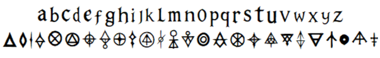

Experimental font and symbolic script by @bunesky.
A dual writing system: readable text + encoded symbols.

Lowercase = readable text  
Uppercase = symbolic system  

## Preview

## Usage

Write normally using lowercase letters.  
Use uppercase to introduce symbolic characters.

Both systems can be combined in the same text.

## License

SIL Open Font License (OFL)

## Context

Originally created as part of the Avalon 3D world prototype.

https://sites.google.com/view/bune-3d
